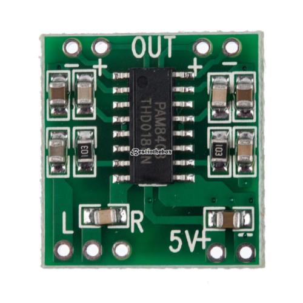

# MyRaspStreamer
most simple streaming solution. Focus is on absolute ease of use.

# Hardware
Raspberry 3, as ist has WLAN support from the start  



# Install 3rd party software

## Solution with mopidy
- mopidy -> streaming daemon
- mpc -> command line client to configure mopidy
- alsa-utils

## solution with volumio 2 (instructions valid for volumio-2.118-2017-03-07-pi)
- volumio -> http://volumio.org. 2 users are created: root and volumio. Both with volumio as password. only volumio can login with ssh
- for pi zero w (from: https://volumio.org/forum/with-new-rpi-zero-t6050-30.html#p30027)
    - Flash Volumio 2.118 image (note later Volumio images WILL contain the fix already)
    - download https://github.com/raspberrypi/firmware/raw/stable/boot/bcm2708-rpi-0-w.dtb on your PC/Mac/whatever
    - copy it in /boot partition of SD
- use the volumio gui to put one radio stream in "My Web Radio" (was http://direct.franceinter.fr/live/franceinter-midfi.mp3)

- put the radio in the playing queue (pull down menu on the right of the radio entry in "My Web Radio" -> "add to queue")
- install cron job in order to stop and restart the radio during the night. All as root (using f.i. sudo)
    - apt-get update && apt-get install -y cron
- reboot in the night
```bash
  sudo crontab -e
  0 3 * * * /sbin/init 6        
```
full path to init is necessary, otherwise the job will not run
- activate "GPIO Plugins" and set "Play/pause" as well as "next". "play/pause" could start and stop, but occassionaly "next" is necessary to allow the cycles to work
    
    
work in progress: https://docs.google.com/document/d/1TDSatWPPN96Mer0wqnUFBJojLpwfW_XxlmbxklHs84c/edit?usp=sharing
